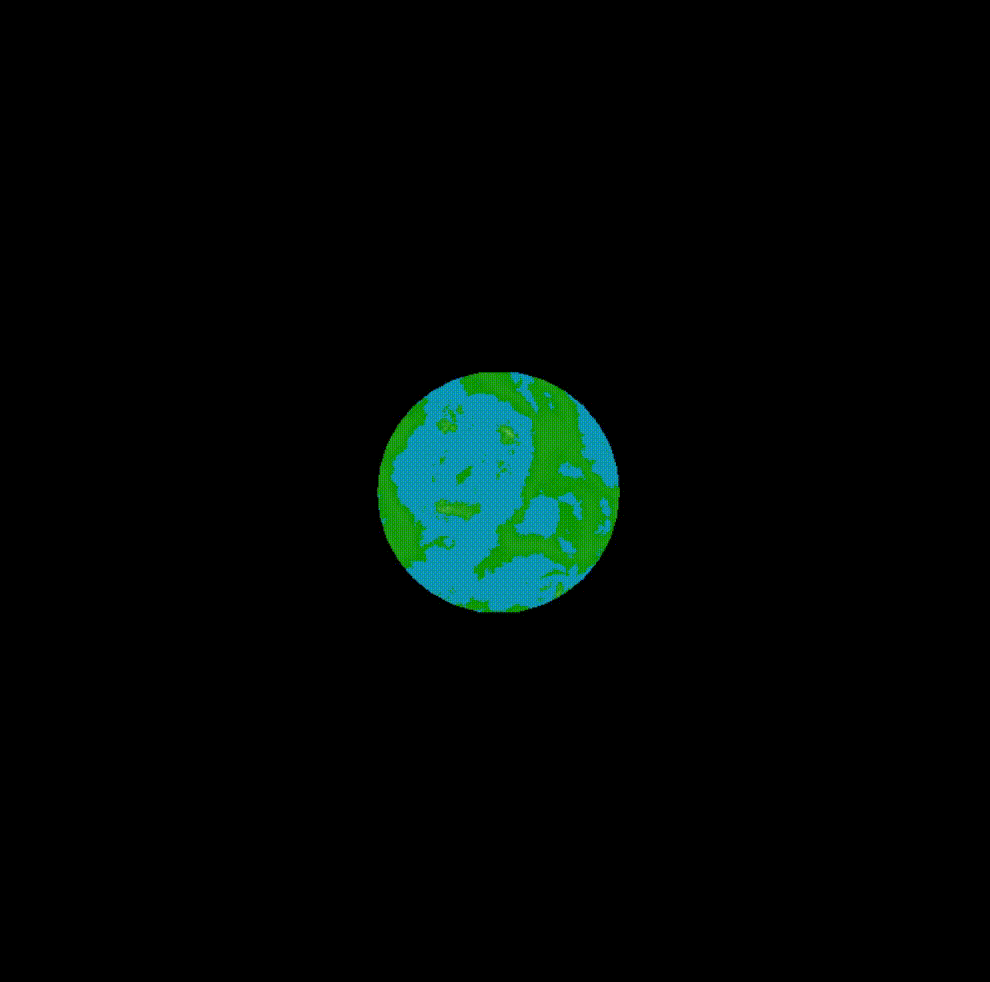
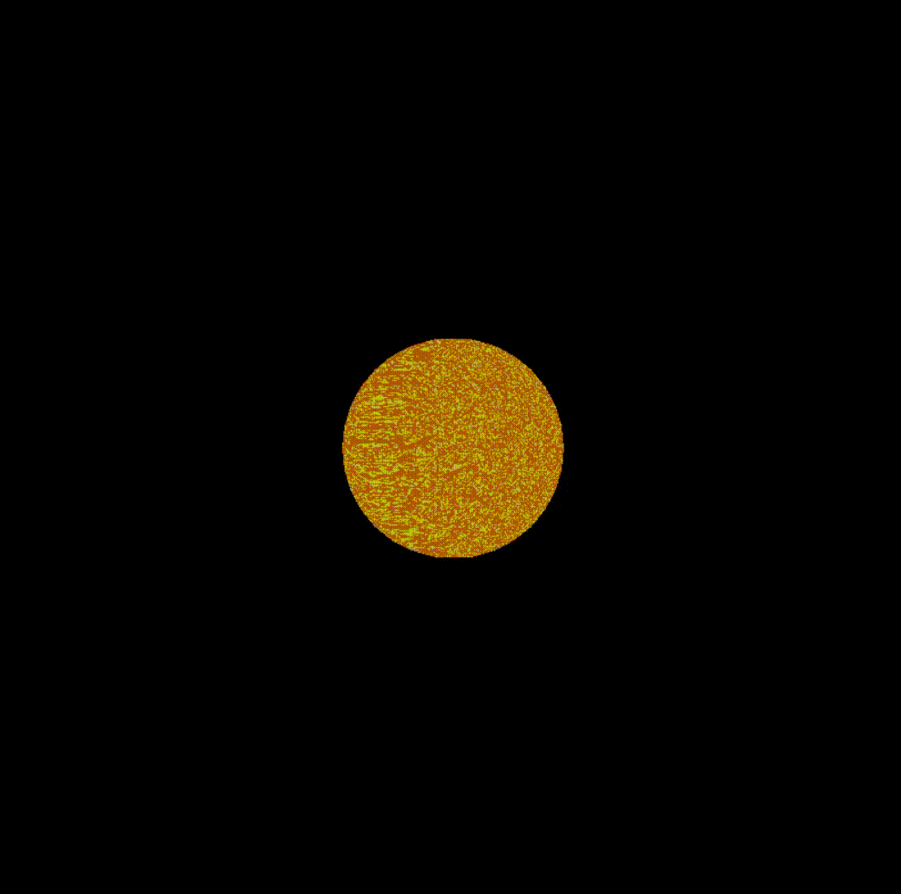
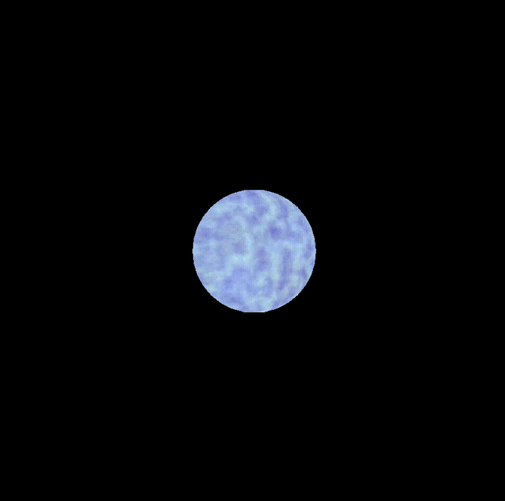
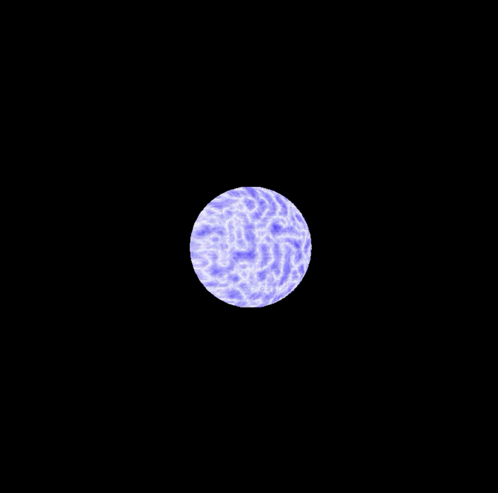
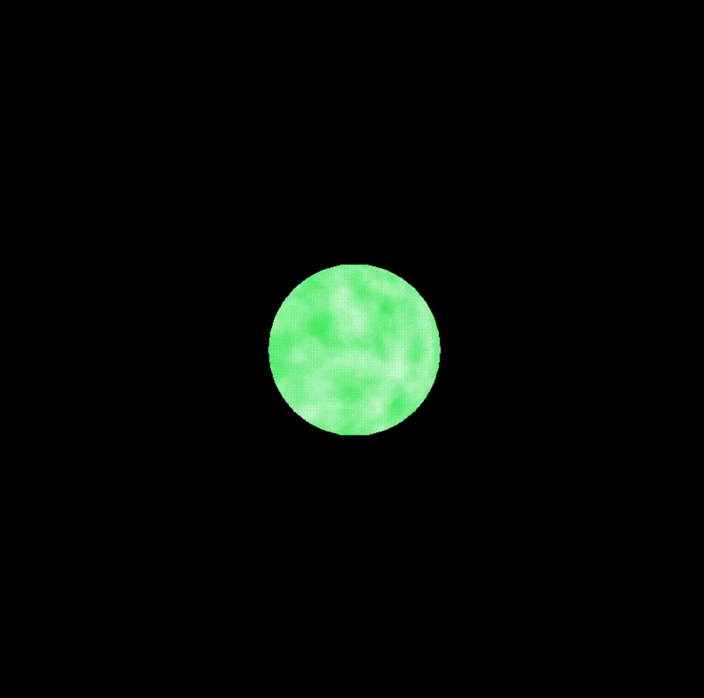
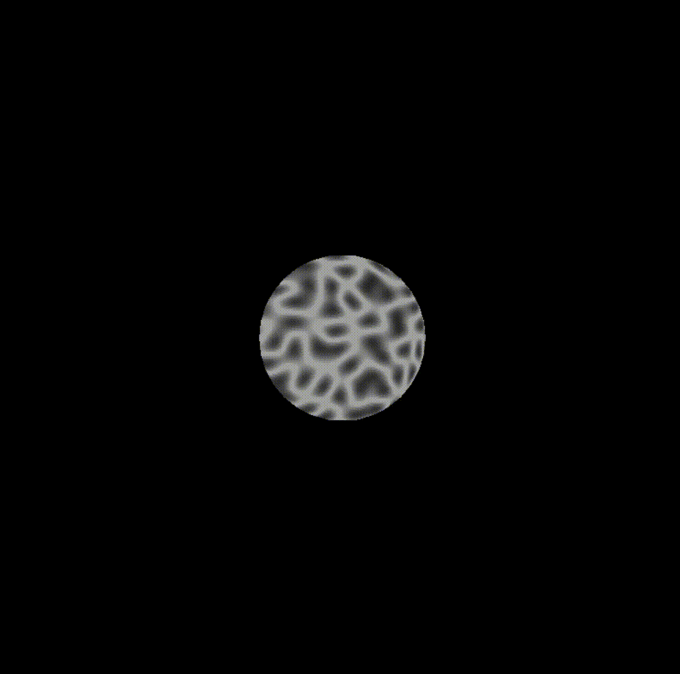
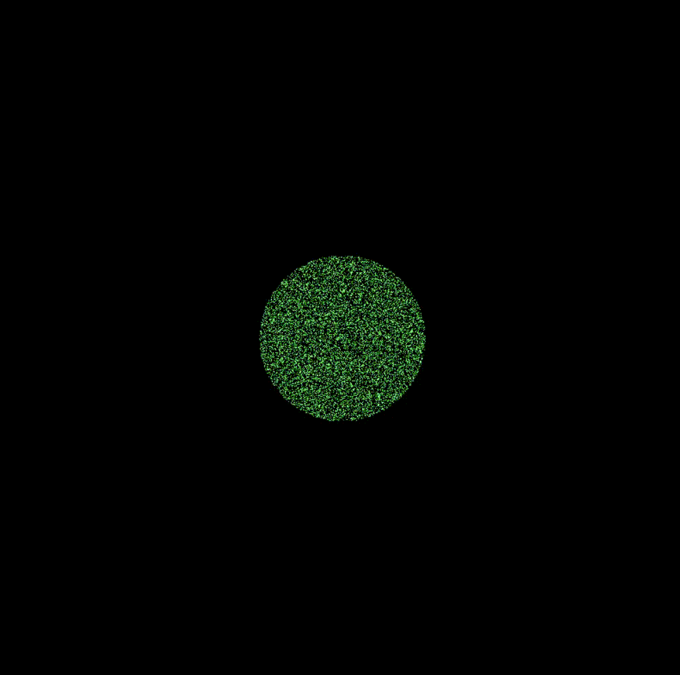
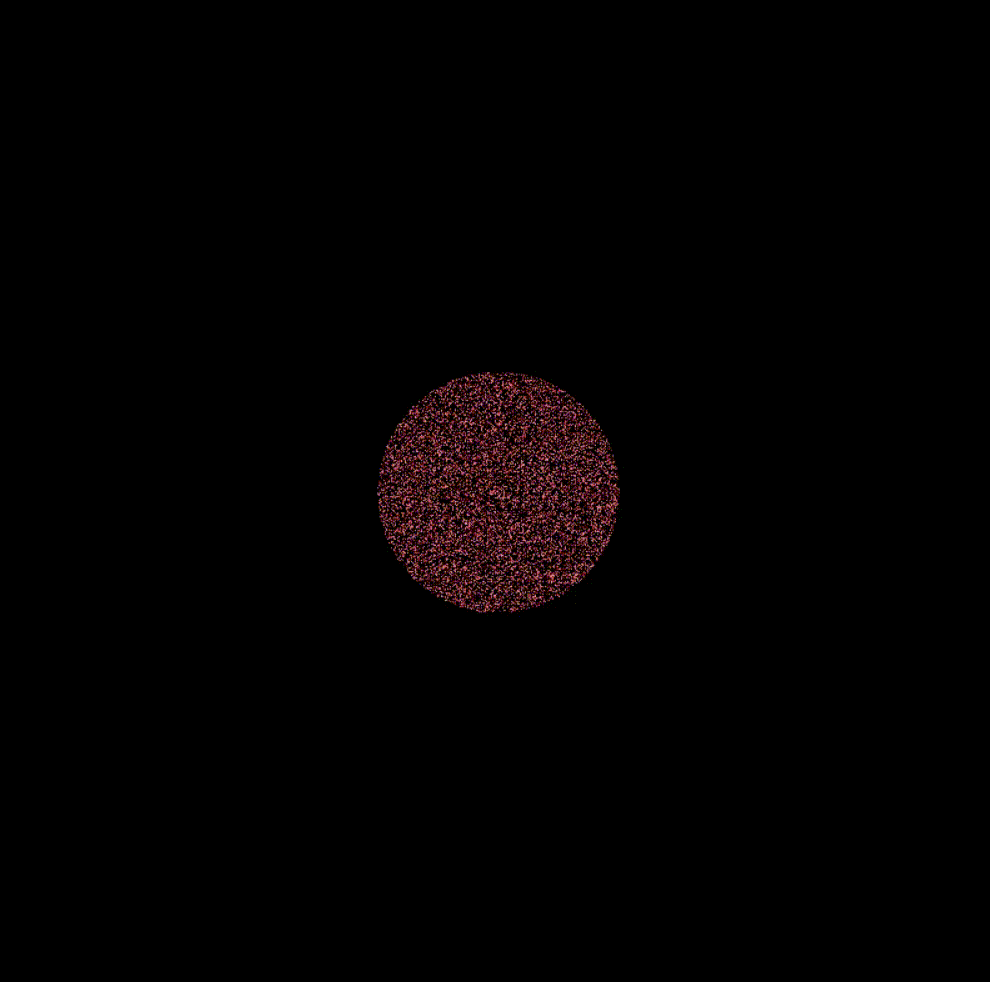
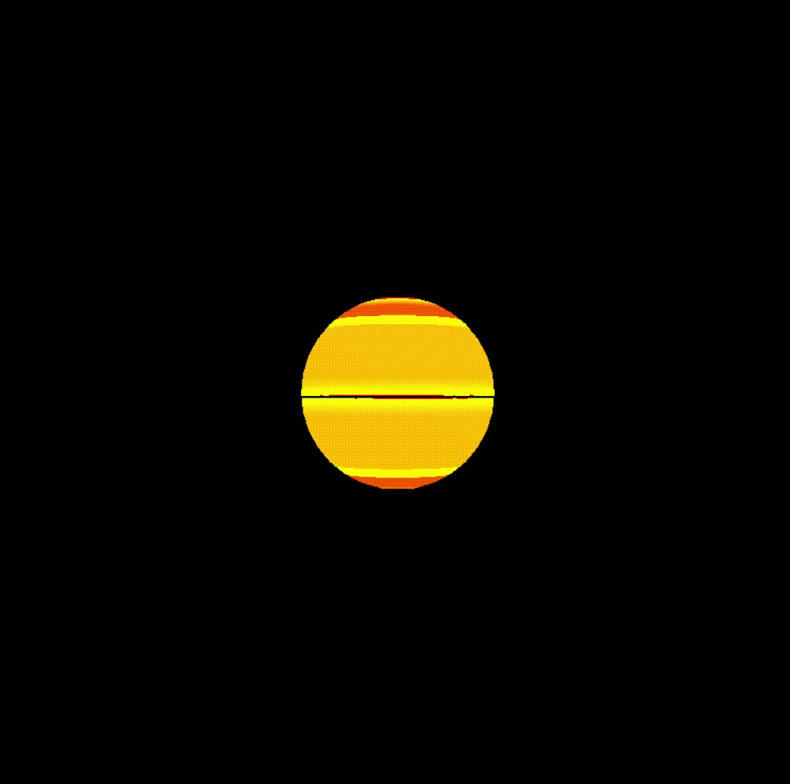

# Documentación

# Planetas

### Tierra

### Sol

### Planeta gaseoso V1

### Planeta gaseoso V2

### Planeta gaseoso V3

### Planeta rocoso

### Estrellas verdes

### Estrellas rojas

### Planeta random

Este documento proporciona una descripción y explicación del código en C++ proporcionado. El código está destinado a renderizar un modelo tridimensional utilizando técnicas de gráficos rasterizados y sombreado.

## Requisitos y Dependencias

Este código utiliza las siguientes bibliotecas y dependencias:

- SDL2: Biblioteca para la creación de ventanas y renderizado.
- glm: Biblioteca matemática para operaciones con vectores y matrices.
- "color.h": Definiciones de colores en formato RGBA.
- "loadObj.h": Funciones para cargar modelos 3D en formato OBJ.
- "vertexArray.h": Definiciones y funciones relacionadas con matrices de vértices.
- "uniform.h": Definiciones para estructuras de datos uniformes.
- "shaders.h": Definiciones para las funciones de los shaders.

## Variables Principales

- `WINDOW_WIDTH` y `WINDOW_HEIGHT`: Ancho y alto de la ventana de renderizado.
- `clearColor`: Color de fondo de la ventana de renderizado.
- `L`: Dirección de la luz en el espacio del ojo.
- `uniforms`: Estructura para almacenar datos uniformes para los shaders.
- `renderer`: Puntero al renderizador de SDL.
- `zbuffer`: Un arreglo para almacenar los valores de profundidad (z-buffer) de los fragmentos.

## Funciones Principales

- `interpolateColor(barycentricCoord, colorA, colorB, colorC)`: Interpola un color usando coordenadas baricéntricas.
- `isBarycentricCoordInsideTriangle(barycentricCoord)`: Comprueba si las coordenadas baricéntricas están dentro de un triángulo.
- `calculateBarycentricCoord(A, B, C, P)`: Calcula las coordenadas baricéntricas de un punto P en un triángulo ABC.
- `triangle(a, b, c)`: Rasteriza un triángulo en fragmentos y realiza interpolación de atributos.
- `render(vertexArray, uniforms)`: Renderiza los vértices transformados del modelo 3D.
- `createViewportMatrix()`: Crea una matriz de transformación de vista.
- `createProjectionMatrix()`: Crea una matriz de proyección.
- `createModelMatrix()`: Crea una matriz de transformación de modelo.

## Función Principal

- `main(argc, argv)`: Inicializa SDL, carga un modelo 3D en formato OBJ, configura las matrices de transformación y bucle principal para renderizar.

## Uso de la Cámara y Luces

El código utiliza la función `glm::lookAt` para establecer la vista de la cámara. La dirección de la luz se transforma en el espacio del ojo.

## Renderizado

El código rasteriza triángulos y realiza la interpolación de atributos, como color e intensidad, utilizando coordenadas baricéntricas. Los fragmentos se sombrean de acuerdo con su normal y la dirección de la luz.

## Matrices de Transformación

El código utiliza matrices de transformación para lograr la proyección, vista y transformaciones de modelo. Las funciones `createProjectionMatrix`, `createViewportMatrix` y `createModelMatrix` generan estas matrices.

## Entrada del Usuario

El bucle principal del programa captura eventos de SDL, como la salida de la ventana, para controlar la ejecución del programa.

---

Este código es un ejemplo educativo de gráficos 3D rasterizados y puede requerir ajustes y optimizaciones para su uso en aplicaciones más complejas.
