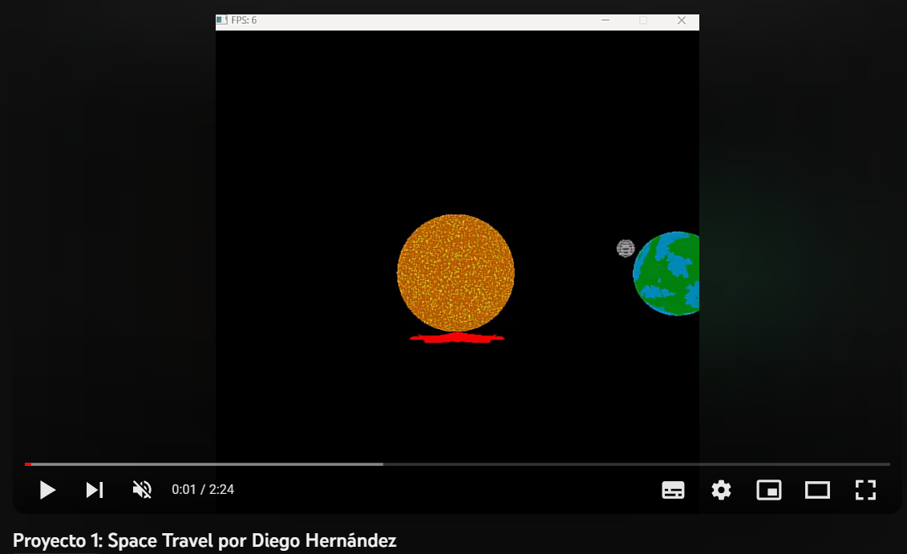

# Simulación del Sistema Solar 🌌🪐🌞

Este proyecto consiste en la creación de una simulación del sistema solar utilizando un software renderer. A continuación, se explica cómo funciona el proyecto y los elementos que se han abordado. Este proyecto es un ejemplo de un rasterizador 3D que utiliza la biblioteca SDL para renderizar objetos 3D en una ventana. El código incluye la capacidad de cargar modelos 3D desde archivos OBJ, aplicar transformaciones de modelo, vista y proyección, realizar interpolación de atributos y aplicar sombreado.

## Demostración del proyecto

Presiona la imagen para ver el video.

## Elementos Abordados ✅

Se abordaron los siguientes elementos:

- **Performance con hilos de la escena completa**: Se optimizó el rendimiento de la simulación para que se sienta apropiado, aunque no necesariamente mantenga 60 frames por segundo.

- **Puntos por cada planeta / estrella / luna en el sistema**: Implementé un total de 6 planetas 🪐 y estrellas en el sistema solar.

- **Puntos por implementar instant warping a diferentes puntos del sistema solar**: Se implementó la capacidad de realizar desplazamientos instantáneos a diferentes puntos del sistema solar mediante las teclas t, g, v, r, y p.

- **Puntos por renderizar una nave modelada por ustedes que siga a su cámara**: Creé una nave 🚀 que sigue a la cámara.

- **Puntos por implementar movimiento 3D para la cámara**: Implementé movimiento tridimensional 🔄 para la cámara, lo que permite una exploración más completa del sistema solar.

## Documentación 📚

A continuación, se proporciona documentación detallada sobre el proyecto:

### Planetas

- **Tierra**
  

- **Sol**
  

- **Planeta gaseoso V1**
  

- **Planeta gaseoso V2**
  

- **Planeta gaseoso V3**
  

- **Planeta rocoso**
  

- **Estrellas verdes**
  

- **Estrellas rojas**
  

- **Planeta random**
  

Este documento proporciona una descripción y explicación del código en C++ proporcionado. El código está destinado a renderizar un modelo tridimensional utilizando técnicas de gráficos rasterizados y sombreado.

## Requisitos y Dependencias 🛠️

Este código utiliza las siguientes bibliotecas y dependencias:

- SDL2: Biblioteca para la creación de ventanas y renderizado.
- glm: Biblioteca matemática para operaciones con vectores y matrices.
- "color.h": Definiciones de colores en formato RGBA.
- "loadObj.h": Funciones para cargar modelos 3D en formato OBJ.
- "vertexArray.h": Definiciones y funciones relacionadas con matrices de vértices.
- "uniform.h": Definiciones para estructuras de datos uniformes.
- "shaders.h": Definiciones para las funciones de los shaders.

## Configuración del Proyecto

Asegúrate de que todas las dependencias estén instaladas y configuradas correctamente. También debes tener modelos 3D en formato OBJ disponibles para cargar. Asegúrate de especificar las rutas correctas en el código para cargar los modelos.

## Variables Principales 🧮

- `WINDOW_WIDTH` y `WINDOW_HEIGHT`: Ancho y alto de la ventana de renderizado.
- `clearColor`: Color de fondo de la ventana de renderizado.
- `L`: Dirección de la luz en el espacio del ojo.
- `uniforms`: Estructura para almacenar datos uniformes para los shaders.
- `renderer`: Puntero al renderizador de SDL.
- `zbuffer`: Un arreglo para almacenar los valores de profundidad (z-buffer) de los fragmentos.

## Funciones Principales 🖥️

- `interpolateColor(barycentricCoord, colorA, colorB, colorC)`: Interpola un color usando coordenadas baricéntricas.
- `isBarycentricCoordInsideTriangle(barycentricCoord)`: Comprueba si las coordenadas baricéntricas están dentro de un triángulo.
- `calculateBarycentricCoord(A, B, C, P)`: Calcula las coordenadas baricéntricas de un punto P en un triángulo ABC.
- `triangle(a, b, c)`: Rasteriza un triángulo en fragmentos y realiza interpolación de atributos.
- `render(vertexArray, uniforms)`: Renderiza los vértices transformados del modelo 3D.
- `createViewportMatrix()`: Crea una matriz de transformación de vista.
- `createProjectionMatrix()`: Crea una matriz de proyección.
- `createModelMatrix()`: Crea una matriz de transformación de modelo.

## Función Principal 🏁

- `main(argc, argv)`: Inicializa SDL, carga un modelo 3D en formato OBJ, configura las matrices de transformación y bucle principal para renderizar.

## Uso de la Cámara y Luces 💡

El código utiliza la función `glm::lookAt` para establecer la vista de la cámara. La dirección de la luz se transforma en el espacio del ojo.

## Renderizado 🖌️

El código rasteriza triángulos y realiza la interpolación de atributos, como color e intensidad, utilizando coordenadas baricéntricas. Los fragmentos se sombrean de acuerdo con su normal y la dirección de la luz.

## Matrices de Transformación 🧮

El código utiliza matrices de transformación para lograr la proyección, vista y transformaciones de modelo. Las funciones `createProjectionMatrix`, `createViewportMatrix` y `createModelMatrix` generan estas matrices.

## Entrada del Usuario 🎮

El bucle principal del programa captura eventos de SDL, como la salida de la ventana, para controlar la ejecución del programa.

## Ajustes Parametrizables 🔄

Toma en cuenta que todos los modelos, uniforms y elementos son parametrizables para poder renderizar varios a la vez.

## Dependencias

El proyecto utiliza las siguientes bibliotecas y herramientas:

- SDL2 para la gestión de ventanas y eventos.
- glm para matemáticas y manipulación de matrices.
- `loadObj` para cargar modelos 3D desde archivos OBJ.
- `vertexArray` para la gestión de datos de vértices y caras.
- `uniform` y `shaders` para administrar uniformes y fragment shaders.
- `color` para representar colores en RGBA.
- `std::mutex` para garantizar la seguridad en hilos.

## Parámetros de Renderizado

El proyecto permite renderizar varios modelos 3D al mismo tiempo. Puedes controlar la posición y orientación de la cámara, así como activar/desactivar la vista frontal de planetas específicos. Los controles incluyen:

- "W" y "S" para mover la cámara hacia adelante y hacia atrás.
- "A" y "D" para mover la cámara hacia la izquierda y la derecha.
- Flechas "Izquierda" y "Derecha" para rotar la vista.
- "T" para mover la cámara a la vista frontal de la Tierra.
- "G" para mover la cámara a la vista frontal de un planeta gaseoso.
- "P" para mover la cámara al sistema solar completo.
- "R" para mover la cámara a la vista frontal de un planeta aleatorio.
- "V" para mover la cámara a la vista frontal de un planeta verde.

## Funcionamiento

El código rasteriza triángulos y realiza la interpolación de atributos, como color e intensidad, utilizando coordenadas baricéntricas. Los fragmentos se sombrean de acuerdo con su normal y la dirección de la luz.

## Matrices de Transformación 🧮

El código utiliza matrices de transformación para lograr la proyección, vista y transformaciones de modelo. Las funciones `createProjectionMatrix`, `createViewportMatrix`, `createModelMatrix`, entre otras, generan estas matrices.

## Entrada del Usuario 🎮

El bucle principal del programa captura eventos de SDL, como la salida de la ventana, para controlar la ejecución del programa.

## Ajustes Parametrizables 🔄

Toma en cuenta que todos los modelos, uniforms y elementos son parametrizables para poder renderizar varios a la vez. Asegúrate de personalizar el código según tu proyecto real y especificar las rutas correctas de los modelos 3D.

Este código es un ejemplo educativo de gráficos 3D rasterizados y puede requerir ajustes y optimizaciones para su uso en aplicaciones más complejas.

